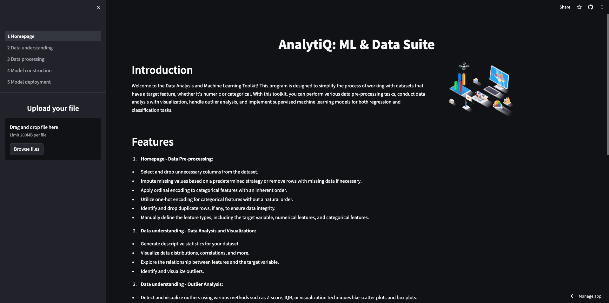

## Introduction

Welcome to the [AnalytiQ: ML & Data Suite](https://analytiq-ml-data-suite.streamlit.app/) (may require waking up)! This program is designed to simplify the process of working with datasets that have a target feature, whether it's numeric or categorical. With this toolkit, you can perform various data pre-processing tasks, conduct data analysis with visualization, handle outlier analysis, and implement supervised machine learning models for both regression and classification tasks.


## Features

1. **Homepage - Data Pre-processing:**
- Select and drop unnecessary columns from the dataset.
- Impute missing values based on a predetermined strategy or remove rows with missing data if necessary.
- Apply ordinal encoding to categorical features with an inherent order.
- Utilize one-hot encoding for categorical features without a natural order.
- Identify and drop duplicate rows, if any, to ensure data integrity.
- Manually define the feature types, including the target variable, numerical features, and categorical features.


2. **Data understanding - Data Analysis and Visualization:**
- Generate descriptive statistics for your dataset.
- Visualize data distributions, correlations, and more.
- Explore the relationship between features and the target variable.   
- Identify and visualize outliers.


3. **Data understanding - Outlier Analysis:**
- Detect and visualize outliers using various methods such as Z-score, IQR, or visualization techniques like scatter plots and box plots.

More screenshots [here](screenshots/)

4. **Data Processing:**
- Choose to treat outliers based on your analysis.
- Prepare the data for machine learning models.
- Perform any required normalization or standardization of numerical features.


5. **Model construction - Supervised Machine Learning:**
- Split the dataset into training and testing subsets for further analysis and modeling.
- Implement regression models for numeric target features.
- Implement classification models for categorical target features.
- Fine-tune model hyperparameters.
- Evaluate model performance using various metrics.


## Kaggle examples
- Numeric target feature: [Price of flats in Moscow Dataset](https://github.com/ramazanabylkassov/AnalytiQ-ML-Data-Suite/blob/main/csv_examples/flats_moscow.csv)
- Categorical target feature: [Titanic train dataset](https://github.com/ramazanabylkassov/AnalytiQ-ML-Data-Suite/blob/main/csv_examples/titanic_train.csv)

# Run the App

To run locally, clone the repository, go to the diretory and install the requirements.

```
pip install -r requirements.txt
```

Now, go to the src directory and run:

```
streamlit run _1_Homepage.py
```

## Contributors
**Ramazan Abylkassov, MD**
- [LinkedIn](https://www.linkedin.com/in/ramazan-abylkassov-23965097/)
- [GitHub repository](https://github.com/ramazanabylkassov/AnalytiQ-ML-Data-Suite)

**Happy data analysis and machine learning!**